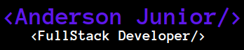
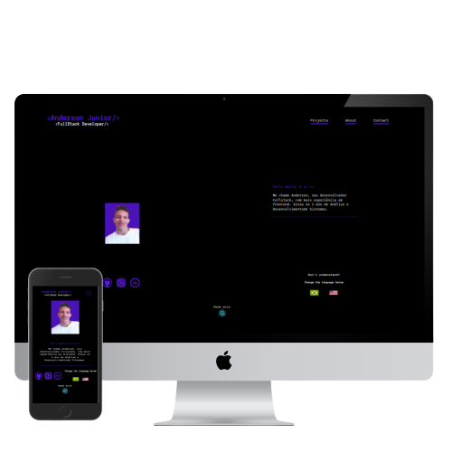

<h1 align="center">Welcome to Anderson's Home👋</h1>

    

  
  
  

<h3 align="center">This is my first personal website and i loved this result.💜</h3>

    

***

<h3 align="center">Wanna see? Click 👇<h3>

    <a style="color:blueviolet; font-weight:bolder; text-decoration:underline;" href="https://andersonarorjdev.github.io/"> CLICK HERE TO ACESS</a>

<h4 align="center" style="color:#61DAFB;">Made With ReactJS💙</h4>

## Author

👤 **Andersonarorjdev**

* Website: https://andersonarorjdev.github.io
* Twitter: [@andersonarorjdev](https://twitter.com/andersonarorjdev)
* Github: [@andersonarorjdev](https://github.com/andersonarorjdev)
* LinkedIn: [@andersonarorjdev](https://linkedin.com/in/andersonarorjdev)

## Show your support

Give a ⭐️ if this project helped you!

## 📝 License

Copyright © 2020 [Andersonarorjdev](https://github.com/andersonarorjdev). 
This project is [MIT](LICENSE) licensed.