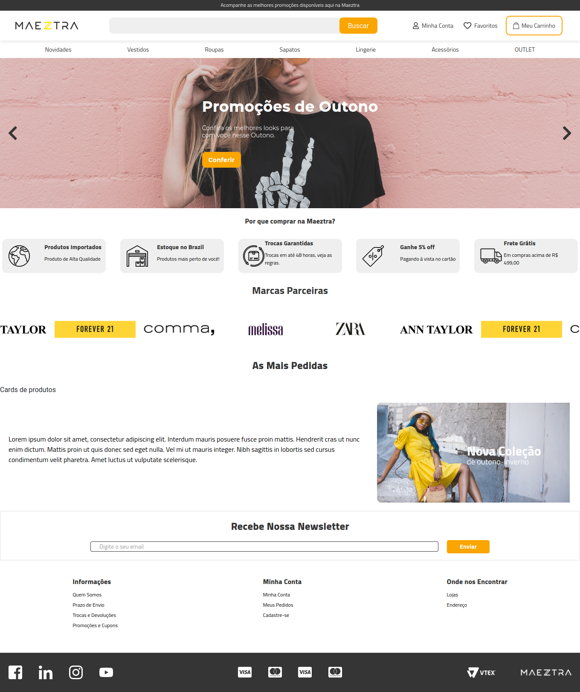

<h1 align="center">Welcome to Maeztra's New Page 👋</h1>
<p>
  
  <a href="LICENSE" target="_blank">
    
  </a>
  <a href="https://twitter.com/andersonarorjdev" target="_blank">
    
  </a>
</p>


<h4>Um layout aparentemente simples...porém desafiador!🧐</h4>

>Olá, como vai?
  Essa interface com uma UI bonita e uma UX certamente muito funcional pode desafiar as habilidades em posicionamentos de qualquer desenvolvedor frontend.
  Busquei desenvolver essa interface da forma mais simples o possível, sendo feito o uso de um ÚNICO framework "Bootstrap"(devido ao prazo, se não teria feito 100% apénas com CSS e JS).
  Desenvolvi a interface o mais próximo o possível do layout proposto, aplicando ao máximo a metodologia "Pixel Perfect" que eu amo desenvolver. Foi um desafio incrível!🚀

***


 <h1 align="center">Small Breakpoint</h1>

 ***
<p align="center">
  
</p>

  <h1 align="center">Expanded Breakpoint</h1>

 ***
<p align="center">
  
</p>

### Tecnologias, metodologias usadas e seus critérios:
- A interface foi reproduzida fielmente ao modelo proposto, apenas com as tecnologias bases(CSS, HTML, Javascrip).😚
- Preferi utilizar a metodologia "Mobile First📲", tendo em vista que a grande maioria dos acessos são através de dispositivos móveis.

#Por que eu não apliquei outros Frameworks ou Libs além do Bootstrap?🤔🤫
>Apesar de que os Frameworks ou Libs podem aumentar, facilitar(e muito) o processo de desenvolvimento, por se tratar de uma interface em nível básico/intermediário de complexidade, decidi reproduzila utilizando tecnologias base e também não achei necessário a aplicação de uma Lib como React ou libs externas em Javascript.

#### Considerações:🥺
- Foi desenvolvido o máximo do layout dentro do prazo, tendo em vista que o único componente que faltou foi card de compras, pois as soluções que consegui com libs externas iriam quebrar o meu controle do layout e poderia ser mais dificil implementar um componente externo e deixar da forma proposta do que desenvolver uma 100% "na mão". Esse foi o único componente que não deu tempo.🤞⏱
- Foi executado os testes de cross-browser e dentro dos testes, saíram como esperado.🙆🏽
- Aplicalção desenvolvido no Firefox🦊
## Baixando o projeto⬇️
```sh
  git clone https://github.com/andersonarorjdev/andersonarorjdev.github.io.git
```

## Acessando o projeto💻
- Na barra de URL do seu navegador digite:
```sh
C://USER/Folder/andersonarorjdev.github.io/index.html
``` 
- Exemplo hipotético e que pode mudar conforme o seu sistema operacional, caminhos de pastas, etc...
## Author

👤 **Andersonarorjdev**

* Website: https://andersonarorjdev.github.io
* Twitter: [@andersonarorjdev](https://twitter.com/andersonarorjdev)
* Github: [@andersonarorjdev](https://github.com/andersonarorjdev)
* LinkedIn: [@andersonarorjdev](https://linkedin.com/in/andersonarorjdev)

## Show your support

Give a ⭐️ if this project helped you!

## 📝 License

Copyright © 2020 [Andersonarorjdev](https://github.com/andersonarorjdev).<br />
This project is [MIT](LICENSE) licensed.